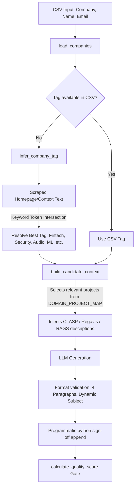

<div align="center">
  
  
  
</div>

<h1 align="center">🚀 Auto Mailer v2</h1>
<p align="center">
  <strong>A highly intelligent, autonomous, and LLM-agnostic cold email orchestration engine.</strong>
</p>

<p align="center">
  Designed specifically for engineers, founders, and recruiters who need to scale hyper-personalized outreach. Auto Mailer fuses your local resume data with live web-scraped company context to generate, gate, and deliver bespoke emails without triggering spam filters.
</p>

---

## 🏗️ Architecture & Pipeline Workflow

The diagram below illustrates how target company details are dynamically matched with your portfolio context, and then validated through quality gates:



### 📊 Summary of Upgraded Components

| Component | Legacy Code (v1.0) | Upgraded Code (v2.0) | Rationale |
| :--- | :--- | :--- | :--- |
| **Token Budget** | `GEN_MAX_TOKENS = 420` | `GEN_MAX_TOKENS = 1500` | Fixes mid-generation truncation crash |
| **Subject Lines** | Hardcoded static string variable | Curated professional preset subjects (deterministic mapping) | Prevents generic or cringe AI subjects and ensures high open rates |
| **CSV Columns** | `Company, Email, Tag, Region, Note` | `Company, Name, Email` | Simplifies pipeline setup |
| **Project Routing** | Direct CSV tag mapping | Dynamic keyword-based context matching | Preserves project targeting without manual tags |
| **Quality Gate** | 100 points: word count & CSV Tag/Note checks | 100 points: name, context match, length sanity | Fits 200-350 word format without false penalties |
| **Contact Score** | 10-point scale: Tag/Note/Region weight | 5-point scale: Email validity, corporate domain, sent history | Removes dead weight columns |
| **Fallback Template** | Legacy 4-bullet layout with old details | Modern 4-paragraph layout with CLASP & Regavis | Matches standard generation format |
| **Checkpoint Sender** | Index-based lookup (`"1"`, `"2"`) | Email-based lookup (with fallback to index string) | Restores checkpoint safety and migration compatibility |

---

## ⚙️ Quick Start

### 1. Installation
Clone the repository and install the dependencies:
```bash
git clone https://github.com/zibranxo/auto-mailer.git
cd auto-mailer
pip install -r requirements.txt
```

### 2. Configuration (`.env`)
Create a `.env` file in the root directory. Auto Mailer v2 has moved *all* tunable parameters to environment variables for maximum flexibility.

```env
# Primary Provider (e.g., NVIDIA NIM or DeepSeek)
LLM_API_KEY=nvapi-your-key-here
LLM_BASE_URL=https://integrate.api.nvidia.com/v1
LLM_MODEL=meta/llama-3.3-70b-instruct
LLM_FALLBACK_MODEL=deepseek-ai/deepseek-v4-flash

# Sender Configuration (Supports up to 10 accounts for rotation)
SENDER_NAME="Arnav Sagar"
SENDER_EMAIL=primary_account@gmail.com
SENDER_APP_PASSWORD=your_primary_app_password

# Optional secondary accounts (auto-balanced and rotated)
SENDER_2_EMAIL=secondary_account@gmail.com
SENDER_2_APP_PASSWORD=your_secondary_app_password
SENDER_3_EMAIL=third_account@gmail.com
SENDER_3_APP_PASSWORD=your_third_app_password

# Limits & Quality Gates
RATE_LIMIT_SECONDS=8
GEN_MAX_TOKENS=1500
EMAIL_MAX_WORDS=400
EMAIL_MAX_SUBJECT_LEN=100
MIN_CONTACT_SCORE=2
MIN_QUALITY_SCORE=70
VARIANT_COUNT=1
```
> **Note:** If using Gmail, you must use an [App Password](https://myaccount.google.com/apppasswords) with 2FA enabled.

### 3. Populate Assets
Ensure the following files are populated in the root directory:
- `hr_emails_directory.csv`: Columns `Company`, `Name`, `Email`.
- `about_me.md`: Your detailed candidate profile/pitch.
- `resume.pdf`: The attachment to send.

---

## 🚀 Core Features User Guide

### 📂 1. Campaign Folder Encapsulation (`--folder`)
Isolate different outreach campaigns cleanly. Instead of mixing targets and checkpoints, you can isolate all inputs and output run reports into a specific campaign directory:
```bash
python mailer.py --folder campaigns/summer_2026 --dry-run
```
* **Behavior:**
  - Auto Mailer searches for the CSV database at `campaigns/summer_2026/hr_emails_directory.csv` (falls back to any `.csv` in that folder if the default name is missing).
  - Saves run reports, checkpoints, logs, and cache indexes inside `campaigns/summer_2026/runs/` and `campaigns/summer_2026/`.

---

### 🧪 2. Safe Previews & Dry Runs (`--dry-run`)
Generate and preview emails locally using the Rich terminal interface without sending actual emails:
```bash
python mailer.py --dry-run --company-research --limit 5
```
* **Key Benefit:** Allows you to verify LLM response formatting, dynamic subject headers, and personalization tokens before dispatching them.

---

### 🔍 3. Active Company Web Research (`--company-research`)
Visits the target company's domain, scraping `<title>` and `<meta>` description headers to inject real-world context into the LLM prompt.
```bash
python mailer.py --company-research --limit 10
```
* **Dynamic Routing:** If a company does not have a hardcoded `Tag` parameter, the scraped context is sent to `infer_company_tag()` which uses keyword token intersection to match it to a domain (`Fintech`, `Security`, `Audio`, `Vision/Aerospace`, `5G/Telecom`, `AI/ML`). This dynamically selects the best projects from your portfolio to pitch.

---

### 🧪 4. Multi-Variant Generation (`--variant-count`)
Generate multiple email drafts in parallel, grade them against quality scoring gates, and choose only the highest-scoring candidate to deliver:
```bash
python mailer.py --company-research --variant-count 3 --limit 5
```
* **Usage:** Setting `--variant-count 3` generates 3 independent emails with slightly different temperatures and selects the most relevant, natural-sounding copy.

---

### 🔄 5. Resuming From Interruptions (`--resume`)
If the script gets interrupted by a network timeout or system shutdown, you can safely resume exactly where you left off without duplicating emails.

You can run it as a standalone flag without arguments to automatically resume the latest run:
```bash
python mailer.py --resume
```
* **Behavior:** Loads the last processed index from the run checkpoint and continues the sequence.
* **Date Rollovers:** If you are resuming a run on a new calendar day (since runs are grouped in directories named by date, e.g., `YYYY-MM-DD`), executing `--resume` without a path will target today's folder. To target a previous day's run, pass the path directly:
  ```bash
  python mailer.py --resume campaigns/summer_2026/runs/2026-07-11
  ```

---

### 🛡️ 6. Hard Bounce Syncing & Suppression (`--check-bounces`)
Connects to your Gmail/SMTP inbox via IMAP to scan for delivery failure notifications and adds those emails to `bounced_log.json` to automatically suppress future attempts:
```bash
python mailer.py --check-bounces --company-research
```

---

### 🌐 7. Pre-Send DNS MX Verification (`--check-mx`)
Queries DNS MX records before generating an email to ensure the domain actually has a working mail server:
```bash
python mailer.py --check-mx --limit 50
```
* **Benefit:** Saves API tokens by skipping invalid domains before making the LLM inference call.

---

### 📊 8. Rich Terminal Summaries & Run Reports
Get instant and detailed feedback after a run is completed. Auto Mailer prints a highly styled Rich table summarizing:
* Total database target targets loaded.
* Successful vs. failed SMTP sends.
* Skipped counts categorized by reason (duplicates, already sent, low score, invalid format).
* LLM draft generation successes and failures.

#### Failure Breakdown Table
If any errors occurred (e.g. an LLM API error or SMTP failure), it prints a secondary table highlighting the exact company name, email address, stage where it failed, and the error code/message.

#### Auto-Generated File Reports
At the end of a run, the system also saves two reports under your campaign's run directory:
* `run_report_YYYYMMDD_HHMMSS.json`: A structured database format for programmatic integration.
* `run_report_YYYYMMDD_HHMMSS.md`: A beautiful markdown summary document.

---

### 🔄 9. Multi-Sender Load Balancing & Auto-Retirement
Scale beyond Gmail's rolling 500 emails/day restriction by load-balancing outreach across multiple accounts:
* **Round-Robin Rotation:** The script automatically rotates through all defined sender accounts (up to 10) in your `.env` file to balance the load evenly.
* **Auto-Retirement on Block:** If a sender account hits Google's sending limit (`550 Daily user sending limit exceeded`) or has authentication issues, the script will **automatically retire it from the active rotation pool** and output a terminal warning.
* **Seamless Retry:** The email sending attempt will immediately rotate to the next active sender and retry the delivery—**the draft is never skipped or failed** due to a blocked sender account.

---

## 📈 Scoring & Gating Systems

Auto Mailer v2 uses two main heuristic gates to evaluate target quality:

### 1. Contact Gate (0 - 5 Scale)
Evaluates whether a target recipient is valid. Controlled by `MIN_CONTACT_SCORE` (default: `2`).
- **Valid Email Format:** +2 points
- **Corporate Domain Indicator:** +2 points (for domains ending in `.co`, `.org`, `.gov`, `.edu`, etc.), +1 point for custom domains, +0 points for generic personal emails (gmail/yahoo).
- **Communication History:** +1 point if not previously contacted, -1 point if contacted.

### 2. Quality Gate (0 - 100 Scale)
Evaluates whether the generated email is well-written. Controlled by `MIN_QUALITY_SCORE` (default: `70`).
- **Subject Length ≤ 100 characters:** +5 points
- **Body Length Sanity (50-500 words):** +5 points
- **Company Name Mentioned in Body:** +20 points
- **Scraped Context Keyword Matched:** +15 points (at least one non-stopword token from the scraped web text appears in the generated body)
- **Technical Personalization Keywords:** +25 points (presence of keywords like `llm`, `rag`, `yolo`, `proxy`, `deepfake`, etc.)
- **Professional Tone Check:** +15 points (absence of stiff phrases like *"please find attached my cv"*, *"respected sir"*, etc.)
- **Spam Likelihood Check:** +15 points (absence of spam triggers like *"100% guaranteed"*, *"urgent"*, etc.)

---

## 🎛️ CLI Arguments Reference

| Argument | Description | Default |
| :--- | :--- | :--- |
| `--dry-run` | Generate and print emails to console without sending. | `False` |
| `--folder` | Encapsulate CSV inputs, logs, and checkpoints inside a folder. | `None` |
| `--company-research` | Enable active `BeautifulSoup4` web scraping. | `False` |
| `--variant-count` | Generate `N` variants concurrently. | `1` |
| `--check-bounces` | Parse IMAP inbox for hard bounces to suppress future attempts. | `False` |
| `--check-mx` | Query DNS for MX records before sending. | `False` |
| `--workers` | Number of concurrent threads for LLM API calls. | `1` |
| `--limit` | Maximum number of successful contacts to process. | All |
| `--resume` | Resume execution from the latest checkpoint in `runs/`. | `False` |

---

## 📁 Repository Structure

```text
auto-mailer/
├── mailer.py               # 🧠 Core orchestration engine
├── test_mailer.py          # 🧪 Full Unit testing suite
├── send_from_saveprogress.py # 📇 Offline/Cache direct sender
├── requirements.txt        # 📦 Dependencies (OpenAI, Rich, BS4, etc.)
├── .env                    # 🔑 Global tunable configurations
├── hr_emails_directory.csv # 📇 Target directory (fallback)
├── about_me.md             # 📝 Identity & Pitch grounding context
├── resume.pdf              # 📄 Attachment file
└── campaigns/              # 📂 Isolated campaigns folders
    └── summer_2026/        # 📂 Target campaign folder
        ├── hr_emails_directory.csv
        ├── sent_log.json
        ├── bounced_log.json
        └── runs/           # 📂 Isolated campaign execution logs
```

---

<div align="center">
  <p><i>Ensure compliance with CAN-SPAM, GDPR, or applicable local outreach regulations when utilizing automated email sequences.</i></p>
  <p>Built with ❤️ for intelligent automation by Aranv Sagar.</p>
</div>
