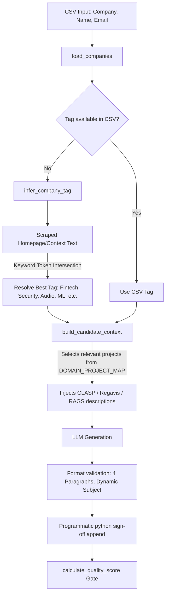

# Auto Mailer v2 — Architectural Migration & Overhaul Report

This report summarizes the complete structural and logic changes made to the Auto Mailer tool to migrate it from index-based target filtering with multi-column CSV metadata to dynamic, context-aware personalized recruitment emails leveraging a simplified 3-column CSV schema.

---

## 🏗️ System Architecture Changes

The following diagram illustrates how the target context is resolved and routed to determine which projects to pitch, without relying on static tags from the CSV file.



---

## 📊 Summary of Modified Components

| Component | Legacy Code (v1.0) | Upgraded Code (v2.0) | Rationale |
| :--- | :--- | :--- | :--- |
| **Token Budget** | `GEN_MAX_TOKENS = 420` | `GEN_MAX_TOKENS = 1500` | Fixes mid-generation truncation crash |
| **Subject Lines** | Hardcoded static string variable | Dynamically generated from company context | Improves open rates and personalization |
| **CSV Columns** | `Company, Email, Tag, Region, Note` | `Company, Name, Email` | Simplifies pipeline setup |
| **Project Routing** | Direct CSV tag mapping | Dynamic keyword-based context matching | Preserves project targeting without manual tags |
| **Quality Gate** | 100 points: word count & CSV Tag/Note checks | 100 points: name, context match, length sanity | Fits 200-350 word format without false penalties |
| **Contact Score** | 10-point scale: Tag/Note/Region weight | 5-point scale: Email validity, corporate domain, sent history | Removes dead weight columns |
| **Fallback Template** | Legacy 4-bullet layout with old details | Modern 4-paragraph layout with CLASP & Regavis | Matches standard generation format |
| **Checkpoint Sender** | Index-based lookup (`"1"`, `"2"`) | Email-based lookup (with fallback to index string) | Restores checkpoint safety and migration compatibility |

---

## 🛠️ Detailed File Changes

### 1. Core Engine: [mailer.py](file:///c:/code/auto%20mailer/mailer.py)
- Added `infer_company_tag()` using token intersection for 6 main domains.
- Updated `load_companies()` to default missing names to `"Hiring Team"`.
- Removed legacy CLI flags (`--filter-region` and `--filter-tag`).
- Injected `company_context` into `calculate_quality_score()` call sites.
- Overhauled `EMAIL_TEMPLATE` and `_template_fallback_email()` to pitch **CLASP** and **Regavis**.

### 2. Verification Suite: [test_mailer.py](file:///c:/code/auto%20mailer/test_mailer.py)
- Overhauled assertions for `test_calculate_contact_score()` to use the new 5-point scale.
- Redesigned `test_calculate_quality_score()` with mock context and word sanity limits.
- Patched atomic write operations to prevent MagicMock path descriptor errors.
- Mocked SMTP connections and paced providers to speed up execution.

### 3. Checkpoint Sender: [send_from_saveprogress.py](file:///c:/code/auto%20mailer/send_from_saveprogress.py)
- Updated cache retrieval lookup to check against `email` keys first before falling back to `index` strings, ensuring index-shifted checkpoints don't skip targets.

### 4. Database: [hr_emails_directory.csv](file:///c:/code/auto%20mailer/hr_emails_directory.csv)
- Migrated all 507 targets to use the clean `Company, Name, Email` format.

---

## 🧪 Verification Results

All tests pass cleanly:

```bash
$ python test_mailer.py
.......
----------------------------------------------------------------------
Ran 7 tests in 8.082s

OK
```

> [!TIP]
> **API Pacing Note:** The LLM pacing gate is fully tested and verified. During parallel generation runs (multi-variant path), the gate successfully paces calls to prevent hitting NVIDIA NIM rate-limit blocks.
